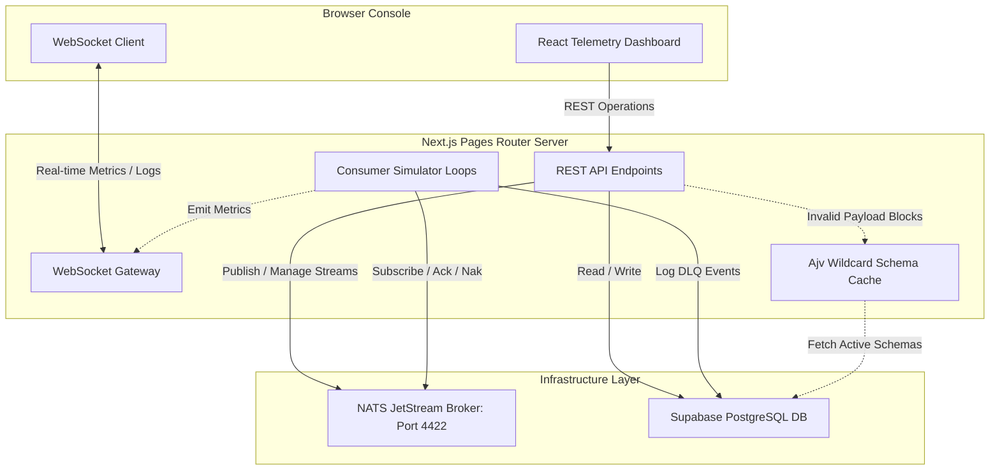

# NATS Event Streaming & Telemetry Console

A high-performance event-streaming telemetry and schema validation platform. This repository consolidates a real-time event broker interface, dynamic JSON schema validator, message retry simulator, and dead-letter queue (DLQ) dashboard into a unified Next.js Pages Router application backed by Supabase.

---

## 1. System Architecture

The platform architecture centers around NATS JetStream for event ingestion and Supabase for persistent metadata and system state.



### Key Components

- **Unified Gateway**: Next.js API routes under `src/pages/api` manage stream configuration, messages, JSON schema registries, simulator nodes, and DLQ replaying.
- **WebSocket Telemetry**: A server gateway (`/api/ws`) upgrades connections and streams NATS stats, active simulator logs, and event metrics to the frontend in real time.
- **Hot-Reload Safety**: Connection pools (NATS clients, WebSocket server caches, active simulator worker loops) are preserved globally during local development compiles to prevent resource spikes or port conflicts.
- **Ajv Validation Engine**: Event payloads published via the portal are validated against registered schemas. It matches subject filters dynamically using a priority precedence rule:
  $$\text{Exact Pattern} \succ \text{Single Wildcard (*)} \succ \text{Global Wildcard (>)}$$

---

## 2. Directory Structure

```filename
event-streaming/
├── docker-compose.yml       # Coordinates NATS JetStream container
├── dashboard/               # Main Next.js application (Unified Frontend & API Gateway)
│   ├── supabase/            # Database schema migrations
│   ├── src/
│   │   ├── __tests__/       # Integration test suites
│   │   ├── lib/             # Shared service singletons (NATS, Schema Validator, Simulators)
│   │   ├── pages/           # Pages Router structure (REST API endpoints & UI index)
│   │   └── styles/          # Baseline design rules
│   ├── package.json
│   └── tsconfig.json
└── backend/                 # Legacy Express app code (Deprecated post-migration)
```

---

## 3. Local Development Setup

Follow these steps to run the NATS Broker and launch the telemetry console locally.

### Step 1: Start NATS JetStream

NATS uses port `4222` by default. Because Windows hosts frequently reserve port ranges within `4127-4226` (causing bind failures), the Docker container maps host port **4422** to container port `4222`.

Spin up the broker from the workspace root:

```bash
docker-compose up -d
```

### Step 2: Set Up Supabase DB

1. Open your project in the [Supabase Console](https://supabase.com/).
2. Navigate to the **SQL Editor** tab.
3. Execute the contents of [setup.sql](file:///c:/Users/User/projects/event-streaming/dashboard/supabase/setup.sql) to provision the database tables (`Schema`, `DlqEvent`, and `ConsumerSimulatorConfig`).

> [!IMPORTANT]
> To run the dashboard using client-side anonymous keys, Row Level Security (RLS) policies are disabled in the setup script. Secure these tables in production.

### Step 3: Configure Environment

Create a `.env.local` file inside the `dashboard/` directory:

```env
NEXT_PUBLIC_SUPABASE_URL=https://your-project-id.supabase.co
NEXT_PUBLIC_SUPABASE_PUBLISHABLE_KEY=your-anon-publishable-key
NATS_URL=nats://localhost:4422
```

### Step 4: Run the Dashboard

Navigate into the dashboard directory and start the Next.js development server:

```bash
cd dashboard
pnpm install
pnpm dev
```

Open [http://localhost:3000](http://localhost:3000) in your browser to access the telemetry console.

---

## 4. Running the Integration Test Suite

A standalone test suite validates connection capabilities, stream CRUD lifecycles, and pattern matching precedence:

```bash
# Execute from dashboard directory
npx tsx src/__tests__/api.test.ts
```

---

## 5. Telemetry & Simulation Flow

1. **Publishing Events**: Payloads are checked against the Ajv compiler cache. If a schema matches the target subject, the payload must be valid or the server blocks the publish request with a `400 Bad Request`.
2. **Mock Consumers**: Register a simulator configuration targeting a stream and subject.
3. **Failures & Retries**: When active, simulators process incoming events. If processing falls below the specified success rate, the event is NAKed (returned to NATS) for retry.
4. **Dead-Letter Queue (DLQ)**: Once an event exceeds the configured `maxDeliver` attempts, the event is acknowledged in NATS and logged as `PENDING` in the Supabase `DlqEvent` table.
5. **Replaying**: Replay events from the DLQ tab on the console, which republishes the payload back to the broker with standard tracking headers (`X-Event-Replayed-From-DLQ`).

---

## 6. Client Integration Examples

Clients can publish events to NATS through the validation gateway and consume real-time statistics/logs over the WebSocket channel.

### Example A: Publishing Events (JavaScript / Node.js)

```javascript
async function publishEvent(subject, payload) {
  try {
    const response = await fetch("http://localhost:3000/api/publish", {
      method: "POST",
      headers: {
        "Content-Type": "application/json",
      },
      body: JSON.stringify({ subject, payload }),
    });

    const result = await response.json();
    if (response.ok) {
      console.log(`[Success] Event published. Sequence: ${result.seq}, Stream: ${result.stream}`);
    } else {
      console.error(`[Failed] Validation/Publish error: ${result.error}`);
    }
  } catch (error) {
    console.error("HTTP network request failed:", error);
  }
}

// Example usage:
publishEvent("events.user.created", {
  userId: "user_12345",
  email: "dev@example.com",
  timestamp: new Date().toISOString()
});
```

### Example B: Consuming Telemetry Stream (Web Browser Client)

```javascript
const socket = new WebSocket("ws://localhost:3000/api/ws");

socket.addEventListener("open", () => {
  console.log("Connected to the real-time telemetry gateway");
});

socket.addEventListener("message", (event) => {
  const message = JSON.parse(event.data);
  
  switch (message.type) {
    case "SYSTEM":
      console.log(`[System]: ${message.message}`);
      break;
    case "STATS":
      console.log("[Stats Update]:", message.data);
      // Contains: streams list, activeSimulators, pendingDlq, registeredSchemas
      break;
    case "LOG":
      console.log(`[Simulator Log] [${message.data.durableName}]: ${message.data.text}`);
      break;
    case "METRICS":
      console.log("[Simulator Metric Counter Incremented]:", message.data);
      break;
  }
});

socket.addEventListener("close", () => {
  console.log("Disconnected from telemetry channel");
});
```
