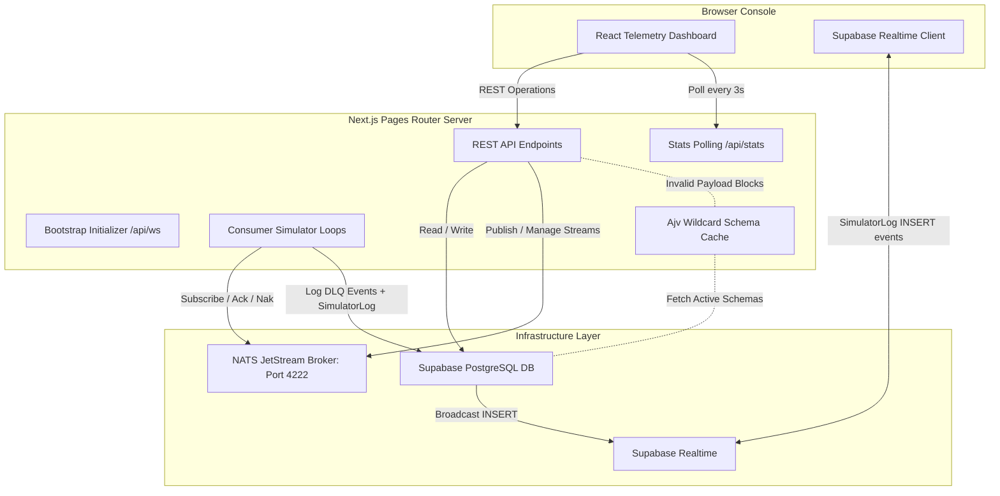

# NATS Event Streaming & Telemetry Console

A production-grade event-streaming telemetry and schema validation platform. This repository consolidates a real-time event broker interface, dynamic JSON schema validator, message retry simulator, and dead-letter queue (DLQ) dashboard into a unified Next.js Pages Router application backed by Supabase.

[](https://vercel.com/new/clone?repository-url=https://github.com/donshammah96/event-streaming&root=dashboard&env=NEXT_PUBLIC_SUPABASE_URL,NEXT_PUBLIC_SUPABASE_PUBLISHABLE_KEY,SUPABASE_SERVICE_ROLE_KEY,NATS_URL)

---

## 1. System Architecture

The platform architecture centers around NATS JetStream for event ingestion and Supabase for persistent metadata, system state, and real-time log streaming.



### Key Components

- **Unified Gateway**: Next.js API routes under `src/pages/api` manage stream configuration, messages, JSON schema registries, simulator nodes, and DLQ replaying.
- **Supabase Realtime Telemetry**: Simulator logs are written to the `SimulatorLog` Supabase table and streamed to the browser via Supabase Realtime channels — no raw WebSocket server required, fully compatible with Vercel's serverless runtime.
- **Stats Polling**: The frontend polls `/api/stats` every 3 seconds with exponential backoff. No persistent server-side connection is needed.
- **Hot-Reload Safety**: Connection pools (NATS clients, active simulator worker loops) are preserved globally during local development compiles to prevent resource spikes or port conflicts.
- **Ajv Validation Engine**: Event payloads published via the portal are validated against registered schemas. It matches subject filters dynamically using a priority precedence rule:
  $$\text{Exact Pattern} \succ \text{Single Wildcard (*)} \succ \text{Global Wildcard (>)}$$

---

## 2. Directory Structure

```filename
event-streaming/
├── docker-compose.yml       # NATS JetStream + Postgres (pinned versions, healthchecks)
├── dashboard/               # Main Next.js application (Unified Frontend & API Gateway)
│   ├── supabase/            # Database schema migrations
│   │   ├── setup.sql        # Initial table creation
│   │   └── realtime_migration.sql  # SimulatorLog table + Realtime publication
│   ├── src/
│   │   ├── __tests__/       # Integration test suites
│   │   ├── lib/             # Shared service singletons (NATS, Schema Validator, Simulators)
│   │   ├── pages/           # Pages Router structure (REST API endpoints & UI index)
│   │   └── styles/          # Baseline design rules
│   ├── vercel.json          # Vercel deployment config (security headers, function timeouts)
│   ├── package.json
│   └── tsconfig.json
└── backend/                 # ⚠️  DEPRECATED — Legacy Express app (pre-migration state)
                             #    See DEPRECATED.md in backend/ for migration notes.
```

---

## 3. Environment Variables

Configure these in `dashboard/.env.local` for local development, or in your Vercel project settings for deployment.

| Variable | Required | Where used | Notes |
|---|---|---|---|
| `NEXT_PUBLIC_SUPABASE_URL` | ✅ | Client + Server | Your Supabase project URL |
| `NEXT_PUBLIC_SUPABASE_PUBLISHABLE_KEY` | ✅ | Client (Realtime) | Anon key — safe for browser use |
| `SUPABASE_SERVICE_ROLE_KEY` | ✅ | Server only | Service-role key — **never expose to browser** |
| `NATS_URL` | ✅ | Server only | e.g. `nats://localhost:4222` |

> [!CAUTION]
> `SUPABASE_SERVICE_ROLE_KEY` bypasses Row-Level Security. It must **never** appear in any `NEXT_PUBLIC_*` variable or be bundled client-side. The codebase enforces this via the split `supabaseServer` / `supabase` client pattern in `src/lib/supabaseClient.ts`.

---

## 4. Local Development Setup

Follow these steps to run the NATS Broker and launch the telemetry console locally.

### Step 1: Start NATS JetStream & Postgres

NATS uses port `4222` by default. Because Windows hosts frequently reserve port ranges (e.g., `4408-4507` and `8173-8272` which prevent binding to `4422` or `8222`), the Docker container maps standard host port **4222** to container port `4222`, and monitoring port **8722** to container port `8222`.

Spin up the broker from the workspace root:

```bash
docker-compose up -d
```

Services have health checks — wait for both to be healthy before proceeding.

### Step 2: Set Up Supabase DB

1. Open your project in the [Supabase Console](https://supabase.com/).
2. Navigate to the **SQL Editor** tab.
3. Execute the contents of [setup.sql](file:///c:/Users/User/projects/event-streaming/dashboard/supabase/setup.sql) to provision the core tables.
4. Execute [realtime_migration.sql](file:///c:/Users/User/projects/event-streaming/dashboard/supabase/realtime_migration.sql) to create the `SimulatorLog` table and enable Realtime streaming.

> [!IMPORTANT]
> Row Level Security (RLS) is disabled in the setup scripts for simplicity. Enable and scope RLS policies before exposing this dashboard to untrusted users.

### Step 3: Configure Environment

Create a `.env.local` file inside the `dashboard/` directory:

```env
NEXT_PUBLIC_SUPABASE_URL=https://your-project-id.supabase.co
NEXT_PUBLIC_SUPABASE_PUBLISHABLE_KEY=your-anon-publishable-key
SUPABASE_SERVICE_ROLE_KEY=your-service-role-key
NATS_URL=nats://localhost:4222
```

### Step 4: Run the Dashboard

Navigate into the dashboard directory and start the Next.js development server:

```bash
cd dashboard
pnpm install
pnpm dev
```

Open [http://localhost:3000](http://localhost:3000) in your browser to access the telemetry console.

---

## 5. Vercel Deployment

1. Click the **Deploy with Vercel** badge at the top of this README, or import the repository manually in the [Vercel dashboard](https://vercel.com/new).
2. Set the **Root Directory** to `dashboard/`.
3. Add all four environment variables from the table above in **Project Settings → Environment Variables**.
4. Deploy. Security headers (CSP, X-Frame-Options, HSTS, etc.) are automatically applied via `vercel.json`.

> [!NOTE]
> The Supabase Realtime channel (simulator logs) and REST stats polling (`/api/stats`) are both fully compatible with Vercel's serverless runtime. No raw WebSocket server is required.

---

## 6. Running the Integration Test Suite

A standalone test suite validates connection capabilities, stream CRUD lifecycles, and pattern matching precedence:

```bash
# Execute from dashboard directory
npx tsx src/__tests__/api.test.ts
```

---

## 7. Telemetry & Simulation Flow

1. **Publishing Events**: Payloads are checked against the Ajv compiler cache. If a schema matches the target subject, the payload must be valid or the server blocks the publish request with a `400 Bad Request`.
2. **Mock Consumers**: Register a simulator configuration targeting a stream and subject.
3. **Failures & Retries**: When active, simulators process incoming events. If processing falls below the specified success rate, the event is NAKed (returned to NATS) for retry.
4. **Dead-Letter Queue (DLQ)**: Once an event exceeds the configured `maxDeliver` attempts, the event is acknowledged in NATS and logged as `PENDING` in the Supabase `DlqEvent` table.
5. **Replaying**: Replay events from the DLQ tab on the console, which republishes the payload back to the broker with standard tracking headers (`X-Event-Replayed-From-DLQ`).
6. **Live Logs**: The browser subscribes to the Supabase `SimulatorLog` Realtime channel. Log entries appear in the Telemetry Console as the simulator writes them to Supabase — no WebSocket server needed.

---

## 8. Client Integration Examples

### Example A: Publishing Events (JavaScript / Node.js)

```javascript
async function publishEvent(subject, payload) {
  try {
    const response = await fetch("http://localhost:3000/api/publish", {
      method: "POST",
      headers: {
        "Content-Type": "application/json",
      },
      body: JSON.stringify({ subject, payload }),
    });

    const result = await response.json();
    if (response.ok) {
      console.log(`[Success] Event published. Sequence: ${result.seq}, Stream: ${result.stream}`);
    } else {
      console.error(`[Failed] Validation/Publish error: ${result.error}`);
    }
  } catch (error) {
    console.error("HTTP network request failed:", error);
  }
}

// Example usage:
publishEvent("events.user.created", {
  userId: "user_12345",
  email: "dev@example.com",
  timestamp: new Date().toISOString()
});
```

### Example B: Subscribing to Live Stats (REST Polling)

Stats are exposed via `GET /api/stats` and return a JSON snapshot:

```javascript
async function pollStats() {
  const res = await fetch("https://your-dashboard.vercel.app/api/stats");
  const stats = await res.json();
  // { streams, activeSimulators, pendingDlq, registeredSchemas, timestamp }
  console.log("[Stats]:", stats);
}
```

---

## 9. Security

- **Key Scoping**: Server-side API routes use `SUPABASE_SERVICE_ROLE_KEY` (bypasses RLS). Browser code uses only the anon `NEXT_PUBLIC_SUPABASE_PUBLISHABLE_KEY` for Realtime subscriptions.
- **Security Headers**: All responses include `X-Frame-Options: DENY`, `X-Content-Type-Options: nosniff`, `Strict-Transport-Security`, `Content-Security-Policy`, and `Referrer-Policy` — configured in both `vercel.json` (Vercel deployments) and `next.config.ts` (self-hosted).
- **DLQ Purge Protection**: The `/api/dlq/purge` endpoint requires a `confirmToken` in the request body and is rate-limited to 1 request per 60 seconds to prevent CSRF-triggered table wipes.
- **RLS**: Row-Level Security is disabled in the setup scripts for simplicity. Production deployments should enable RLS and add scoped policies.

---

## 10. Deprecated: `backend/` Express App

The `backend/` directory contains a legacy Express.js server that was the original implementation before migration to Next.js API routes + Supabase. It is **no longer used** by the dashboard.

It is kept in the repository to demonstrate the pre-migration architecture for portfolio purposes. See `backend/DEPRECATED.md` for the full migration note.

> [!WARNING]
> Do not use `backend/.env` credentials in production. The file is now gitignored via `backend/.gitignore`. Rotate any credentials that may have previously been committed.
