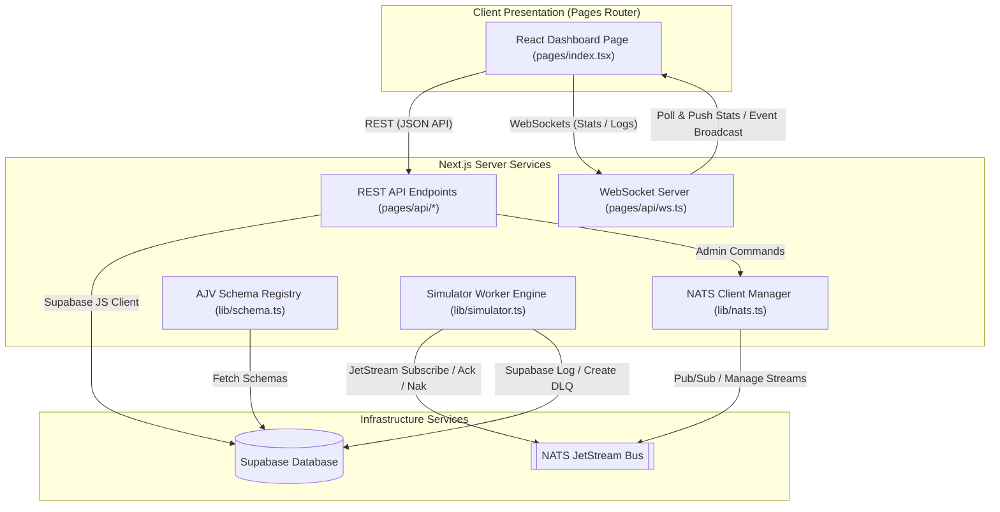

# NATS JetStream Telemetry & Control Dashboard (Next.js Pages Router + Supabase)

This project is a unified, real-time message bus telemetry dashboard and controller built in **Next.js Pages Router**, integrating directly with **NATS JetStream** and utilizing **Supabase** as the database layer.

---

## 1. System Architecture

The Express API gateway, WebSocket telemetry gateway, and React SPA client have been migrated into a unified Next.js application.



### Next.js Integration Highlights

- **WebSocket Server**: Binds custom `ws` listeners directly onto Next.js's node server instance.
- **Connection Singletons**: NATS connection client and background simulator worker registries are cached globally on the Node process context during development to prevent connection spikes or thread leakage across Next.js hot-reloads.

---

## 2. Supabase Database Schema Setup

To initialize the required tables on your Supabase project:

1. Log in to the [Supabase Dashboard](https://supabase.com/).
2. Select your project and navigate to the **SQL Editor** tab.
3. Open the file `supabase/setup.sql` in this directory.
4. Copy the SQL script contents, paste them into the SQL editor, and click **Run**.

This script will set up the following tables:

- `Schema` - Stores JSON Schema validation rules matching subject wildcard filters.
- `DlqEvent` - Logs failed consumer event payloads and error traces.
- `ConsumerSimulatorConfig` - Tracks configuration parameters and execution states of background mock workers.

---

## 3. Local Development Setup

Follow these steps to spin up NATS JetStream and run the application locally:

### Step 1: Start NATS Container

In the workspace root directory, start the NATS JetStream container. Note that NATS has been mapped to host port **4222** (and monitoring port **8722** to prevent conflicts with reserved port exclusions on Windows hosts):

```bash
docker-compose up -d
```

### Step 2: Configure Environment Variables

Create a `dashboard/.env.local` file in the dashboard directory:

```env
NEXT_PUBLIC_SUPABASE_URL=https://your-supabase-project.supabase.co
NEXT_PUBLIC_SUPABASE_PUBLISHABLE_KEY=your-supabase-publishable-anon-key
NATS_URL=nats://localhost:4222
```

### Step 3: Run the Development Server

Navigate to the dashboard directory and start the Next.js dev server:

```bash
pnpm dev
```

Open [http://localhost:3000](http://localhost:3000) in your browser to load the telemetry console.

---

## 4. Running the Integration Test Suite

The project features a dedicated end-to-end integration test runner validating NATS connections, stream CRUD operations, and wildcard schema precedence sorting logic:

```bash
# From the dashboard directory
npx tsx src/__tests__/api.test.ts
```
